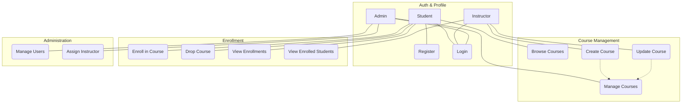

# Use Case Diagram

```mermaid
graph TD
    S[Student]
    I[Instructor]
    A[Admin]

    subgraph "Auth & Profile"
        S --- Reg(Register)
        S --- Log(Login)
        I --- Log
        A --- Log
    end

    subgraph "Course Management"
        S --- Browse(Browse Courses)
        I --- Create(Create Course)
        I --- Update(Update Course)
        A --- ManageC(Manage Courses)
        Create -.-> ManageC
        Update -.-> ManageC
    end

    subgraph "Enrollment"
        S --- Enroll(Enroll in Course)
        S --- Drop(Drop Course)
        S --- ViewE(View Enrollments)
        I --- ViewS(View Enrolled Students)
    end

    subgraph "Administration"
        A --- ManageU(Manage Users)
        A --- Assign(Assign Instructor)
    end
```
